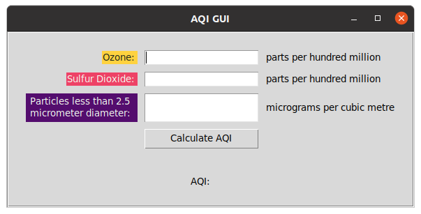
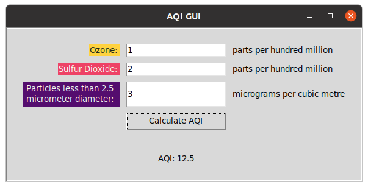
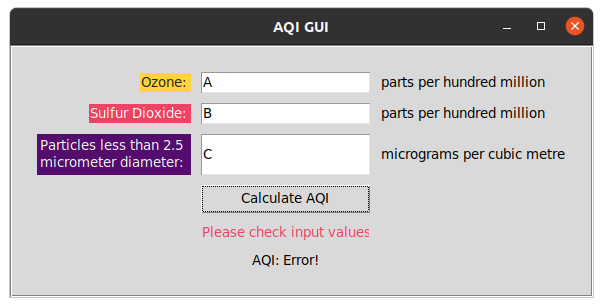

# AQI Pollutant Calculator (GUI)

This GUI version of the AQI calculator program was designed for use by Codetown council workers in various parts of the city to collect air quality information, which will be used to help make informed decisions for future changes in the town.

## Table of Contents

- [AQI Pollutant Calculator (GUI)](#aqi-pollutant-calculator-gui)
  - [Table of Contents](#table-of-contents)
  - [Installation](#installation)
  - [Usage](#usage)
  - [Example Usage](#example-usage)
  - [Walk-through Guide](#walk-through-guide)
  - [Calculation Details](#calculation-details)
  - [Acknowledgement](#acknowledgement)

## Installation

This program makes use of the `tkinter` package. Installation instructions for `tkinter` vary by operating system and are beyond the scope of this README. 

This program was designed to run optimally with `Python 3.8.2`

## Usage

To run the program, enter the following commands into your terminal prompt

1. Change to the directory where the application is installed with `cd /<PATH>/<TO>/<PROGRAM>/air-quality-gui`
2. Start the program with `python3 aqigui.py` 
3. Enter inputs into the fields provided. 

## Example Usage

```bash
$ python3 aqigui.py
```


_The program in its default state_


_The program producing a result_


_The program throwing an error_


## Walk-through Guide

The program will first request the number of air quality measurements that will be entered in the interaction with the program.

It will then loop over the given input to collect the amount of ozone (parts per hundred million), sulfur dioxide (parts per hundred million), and particles less than 2.5 micrometers diameter (micrograms per cubic metre) that were measured for each site.

At the end of each cycle of inputs, the program will output the air quality index (AQI) for that measurement (using the calculation below).

## Calculation Details

`AQI_pollutant = 100*(pollutant data reading)/standard`, where `pollutant data reading` is the value entered by the user for that pollutant and the standard value for each pollutant is given in the following table.

_The following table can be used to reference standard pollutant values:_

| Pollutant      | Standard value                                                  |
| -------------- | --------------------------------------------------------------- |
| Ozone          | 8.0 parts per hundred million                                   |
| Sulfur dioxide | 20 parts per hundred million                                    |
| Particles      | less than 2.5 micrometre diameter 25 micrograms per cubic metre |

## Acknowledgement

Thanks to [@dpaul4](mailto:dpaul4@une.edu.au) for providing the AQI calculation algorithm
